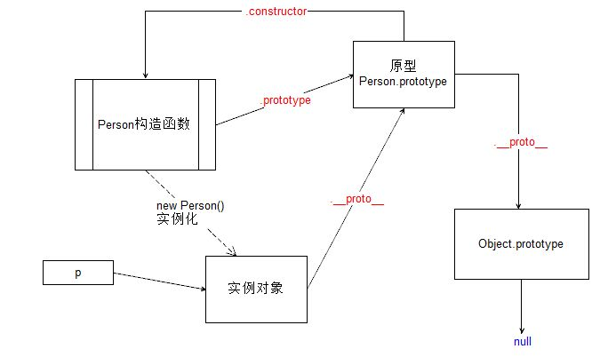

## 原型链

## 绘制原型三角
    1. 先画构造函数
    2. 因为有构造函数就有原型，所以画原型
    3. 画构造函数和原型之间的关系
    4. 画实例化出来的对象
    5. 画实例和构造函数以及原型之间的关系
## constructor属性
    1. 原型中的属性
    2. 是在构造函数创建出来的时候，系统创建原型的时候，默认的让原型中的constructor属性指向构造函数本身
    3. 这个属性基本用不到
## 原型链
    对象都有原型，原型也是对象，所以原型也有原型，所以就形成了一条链式结构，这个结构就叫做原型链
### 绘制原型链图
    1. 先画构造函数
    2. 因为有构造函数就有原型，所以画原型
    3. 画构造函数和原型之间的关系
    4. 画实例化出来的对象
    5. 画实例和构造函数以及原型之间的关系
    6. 把原型当做对象来对待，找到原型的构造函数，将构造函数画出来
    7. 画出上一步中构造函数的原型
    8. 把第6步和第7不步中的构造函数和原型之间的关系画出来
    9. 把第6步中的原型和其构造函数还有原型之间的关系画出来
    重复 6-9 直到画到 Object.prototype 让其原型指向null 就结束了
### 属性搜索原则
    1.现在对象本身中进行查找，如果找到了就直接使用
    2.如果没有，就去原型中查找，如果找到了就直接使用
    3.如果没有找到，就去原型的原型中查找，以此往复，直到找到null

### Array.prototype 是一个空数组

//arr---->Array.prototype----->Object.Prototype----->null
var arr = [];


## instanceof 关键字
```js
对象  instanceof 构造函数
//返回值为boolean类型
//功能： 判断构造函数的原型是不是在该对象的原型链上
```
## Object.prototype的成员
* constructor 原型中的属性指向和原型相关的构造函数
* hasOwnProperty
```js
对象.hasOwnProperty(属性名)
//返回值为boolean类型
//功能：判断属性是否存在对象本身中
```
* isPrototypeOf
```js
对象.isPrototypeof(对象1)
//返回值为boolean
//功能：判断对象是否是对象1的原型对象
```
* propertyIsEnumerable
```js
对象.propertyIsEnumberable(属性名)
//返回值为boolean
//功能：判断属性是否属于对象本身并且能够被遍历（for-in）
```
* toString toLocaleString
    都是将对象转换成字符串类型
    toLocaleString会将字符串转换成本地格式的字符串， 本地格式为系统设置

* valueOf
    在对象参与运算的时候，会首先调用valueOf方法，如果获取到的值能够参与运算就直接使用，
    如果不能参与运算，就调用toString方法
    []==![] true
    {}==!{} false


## Function
    用来创建函数的
* 如果不传参数，创建出来的是空函数
* 如果传一个参数，创建出来的时候有函数体，但是没有形参的函数
* 如果传多个参数，最后参数会被作为函数体，之前所有的参数都会被作为形参

可以把字符串转换成代码
## eval
    也可以将字符串转换成代码并且执行
### Function和eval的区别
    * Funtion创建出来的是函数，函数需要手动调用，里面的代码才会执行
    * eval直接回将字符串转换成代码，并且执行

### Function和eval的共同点
    * 都可以将字符串转换成代码
    * 都不安全
### eval处理JSON格式字符串的时候
    * 会把JSON格式字符串中的{}当做代码段来处理，所以会报错
    * 处理方式两种
        * 给JSON字符串前后拼接小括号()
        * 将变量的声明以及等号 拼接在JSON格式字符串的前面

## 静态成员和实例成员
* 静态成员：通过构造函数去访问的成员就是静态成员
* 实例成员：通过实例去访问的成员就是实例成员

## arguments对象
arguments对象是函数中的一个对象，在函数调用的时候，会将所有传入的实参依次存入该对象

* length  获取传入实参的个数
* callee  指向函数本身   匿名函数的递归
